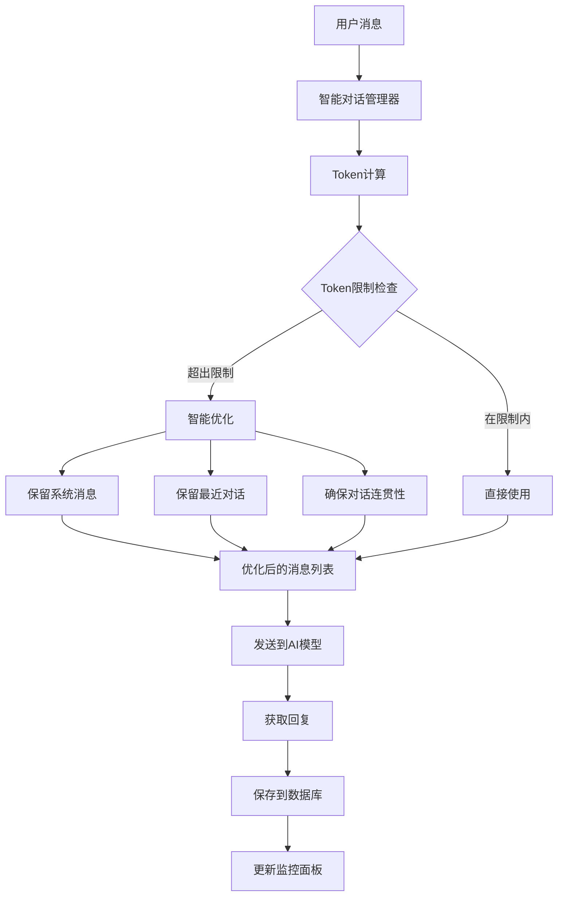
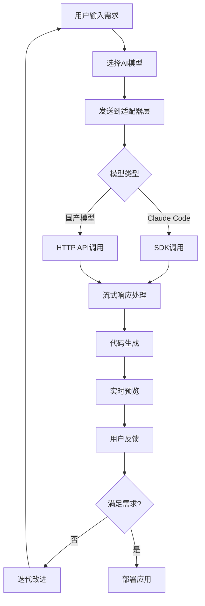

# Claudable - 支持国产AI大模型的Web应用构建工具


<div align="center">
<h3>连接Claude Code，构建你想要的，立即部署。</h3>
<h4>🇨🇳 现已支持国产AI大模型：DeepSeek、通义千问、Kimi、豆包</h4>

<p>由 <a href="https://opactor.ai">OPACTOR</a> 提供支持</p>
</div>

## 🌟 什么是Claudable？

Claudable是一个强大的基于Next.js的Web应用构建工具，它结合了**Claude Code**的先进AI代理能力和**Lovable**的简洁直观的应用构建体验，现在**首次支持国产AI大模型**！只需描述你的应用想法——"我想要一个任务管理应用，支持暗黑模式"——观看Claudable即时生成代码并展示你的工作应用实时预览。你可以免费将应用部署到Vercel并集成Supabase数据库。

这个开源项目使你能够轻松地**免费**构建和部署专业的Web应用。

## ✨ 核心特性

### 🤖 多模型AI支持
- **Claude Code & Cursor CLI**: 原生支持，具备先进的AI代理能力和MCP协议
- **DeepSeek (深度求索)**: 专业代码生成模型，高性价比
- **通义千问 (阿里云)**: 强大的中文理解能力，多模态支持
- **Kimi (月之暗面)**: 超长上下文窗口，文档理解能力强
- **豆包 (字节跳动)**: 高效智能助手，中文优化

### 🚀 强大的功能
- **自然语言到代码**: 用自然语言描述需求，生成生产级Next.js代码
- **即时预览**: 热重载支持，实时查看应用变化
- **零配置启动**: 无需复杂的沙箱环境、API密钥或数据库配置困扰
- **美观UI**: 使用Tailwind CSS和shadcn/ui生成现代化UI
- **一键部署**: 单击推送到Vercel，无需配置
- **GitHub集成**: 自动版本控制和持续部署设置
- **Supabase数据库**: 连接生产级PostgreSQL，预置身份验证
- **自动错误检测**: 检测应用中的错误并自动修复

## 🏗️ 系统架构

### 整体架构图

```
┌─────────────────────────────────────────────────────────────────┐
│                        Claudable 系统架构                        │
├─────────────────────────────────────────────────────────────────┤
│  前端 (Next.js)          │  后端 (Python Flask)                   │
│  ┌─────────────────┐    │  ┌─────────────────────────────────┐    │
│  │   用户界面      │────┼─▶│       API 服务                │    │
│  │  - 项目管理     │    │  │  - REST API                   │    │
│  │  - AI 聊天界面   │    │  │  - WebSocket 通信              │    │
│  │  - 实时预览     │    │  │  - 项目管理                    │    │
│  │  - 配置设置     │    │  └─────────────────────────────────┘    │
│  └─────────────────┘    │                │                        │
│           │              │                ▼                        │
│           │              │  ┌─────────────────────────────────┐    │
│           │              │  │      AI 适配器层                │    │
│           │              │  │  ┌─────────────────────────────┐ │    │
│           │              │  │  │     统一CLI管理器           │ │    │
│           │              │  │  └─────────────────────────────┘ │    │
│           │              │  │  ┌─────────────────────────────┐ │    │
│           │              │  │  │    API适配器工厂           │ │    │
│           │              │  │  └─────────────────────────────┘ │    │
│           │              │  └─────────────────────────────────┘    │
│           │              │                │                        │
│           │              │                ▼                        │
│  ┌─────────────────┐    │  ┌─────────────────────────────────┐    │
│  │    热重载       │◀───┼──│       模型提供商                │    │
│  │    预览服务     │    │  │                               │    │
│  └─────────────────┘    │  │ ┌─────┐ ┌─────┐ ┌─────┐ ┌─────┐ │    │
└─────────────────────────┼──│ │Claude│ │ 深度 │ │通义 │ │ Kimi│ │    │
                          │  │ │Code │ │求索 │ │千问 │ │     │ │    │
┌─────────────────────────┼──│ └─────┘ └─────┘ └─────┘ └─────┘ │    │
│      数据存储          │  │                               │    │
│  ┌─────────────────┐   │  │ ┌─────┐ ┌─────┐ ┌─────┐ ┌─────┐ │    │
│  │   SQLite        │   │  │ │Cursor│ │ 豆包 │ │     │ │     │ │    │
│  │   (开发环境)     │   │  │ │ CLI │ │     │ │     │ │     │ │    │
│  └─────────────────┘   │  │ └─────┘ └─────┘ └─────┘ └─────┘ │    │
│  ┌─────────────────┐   │  └─────────────────────────────────┘    │
│  │  PostgreSQL     │   │                                        │
│  │  (生产环境)      │   │                                        │
│  └─────────────────┘   │                                        │
└─────────────────────────┘                                        │
                                                                   │
┌─────────────────────────────────────────────────────────────────┤
│                     外部服务集成                                  │
│                                                                 │
│ ┌─────────────┐  ┌─────────────┐  ┌─────────────┐                │
│ │   GitHub    │  │   Vercel    │  │  Supabase   │                │
│ │  版本控制    │  │   部署      │  │   数据库     │                │
│ └─────────────┘  └─────────────┘  └─────────────┘                │
└─────────────────────────────────────────────────────────────────┘
```

### AI模型适配器架构

```
┌─────────────────────────────────────────────────────────────────┐
│                     AI模型适配器架构                             │
├─────────────────────────────────────────────────────────────────┤
│                                                                 │
│  ┌─────────────────────────────────────────────────────────┐    │
│  │                 用户请求                                │    │
│  │        "创建一个待办事项应用"                            │    │
│  └──────────────────┬──────────────────────────────────────┘    │
│                     │                                           │
│                     ▼                                           │
│  ┌─────────────────────────────────────────────────────────┐    │
│  │              统一CLI管理器                                │    │
│  │   - 路由请求到合适的模型                                  │    │
│  │   - 统一消息格式                                         │    │
│  │   - 流式响应处理                                         │    │
│  └──────────────────┬──────────────────────────────────────┘    │
│                     │                                           │
│                     ▼                                           │
│  ┌─────────────────────────────────────────────────────────┐    │
│  │              适配器选择                                  │    │
│  │                                                         │    │
│  │  ┌─────────┐  ┌─────────┐  ┌─────────┐  ┌─────────┐     │    │
│  │  │ Claude  │  │DeepSeek │  │  Qwen   │  │  Kimi   │     │    │
│  │  │  Code   │  │Adapter  │  │Adapter  │  │Adapter  │     │    │
│  │  └─────────┘  └─────────┘  └─────────┘  └─────────┘     │    │
│  │  ┌─────────┐  ┌─────────┐                              │    │
│  │  │ Cursor  │  │ Doubao  │                              │    │
│  │  │  CLI    │  │Adapter  │                              │    │
│  │  └─────────┘  └─────────┘                              │    │
│  └──────────────────┬──────────────────────────────────────┘    │
│                     │                                           │
│                     ▼                                           │
│  ┌─────────────────────────────────────────────────────────┐    │
│  │              API调用层                                   │    │
│  │                                                         │    │
│  │  ┌─────────┐  ┌─────────┐  ┌─────────┐  ┌─────────┐     │    │
│  │  │ SDK调用 │  │HTTP API │  │HTTP API │  │HTTP API │     │    │
│  │  │         │  │         │  │         │  │         │     │    │
│  │  └─────────┘  └─────────┘  └─────────┘  └─────────┘     │    │
│  │  ┌─────────┐  ┌─────────┐                              │    │
│  │  │CLI调用  │  │HTTP API │                              │    │
│  │  │         │  │         │                              │    │
│  │  └─────────┘  └─────────┘                              │    │
│  └──────────────────┬──────────────────────────────────────┘    │
│                     │                                           │
│                     ▼                                           │
│  ┌─────────────────────────────────────────────────────────┐    │
│  │              响应处理                                    │    │
│  │   - 流式响应解析                                         │    │
│  │   - 消息格式统一                                         │    │
│  │   - 错误处理                                            │    │
│  └──────────────────┬──────────────────────────────────────┘    │
│                     │                                           │
│                     ▼                                           │
│  ┌─────────────────────────────────────────────────────────┐    │
│  │              代码生成结果                                │    │
│  │        完整的Next.js应用代码                              │    │
│  └─────────────────────────────────────────────────────────┘    │
└─────────────────────────────────────────────────────────────────┘
```

## 🚀 快速开始

### 系统要求

在开始之前，请确保你已安装以下软件：
- Node.js 18+
- Python 3.10+
- Claude Code 或 Cursor CLI（已登录）
- Git

### 安装步骤

```bash
# 克隆仓库
git clone https://github.com/opactorai/Claudable.git
cd Claudable

# 安装所有依赖 (Node.js 和 Python)
npm install

# 配置国产AI模型API密钥（可选）
npm run setup:ai-keys

# 启动开发服务器
npm run dev
```

你的应用将在以下地址可用：
- 前端：http://localhost:3000
- API服务器：http://localhost:8080
- API文档：http://localhost:8080/docs

**注意**：端口会自动检测。如果默认端口被占用，将自动分配下一个可用端口。

## 🔧 国产AI模型配置

### 💬 智能多轮对话系统

针对你提出的问题，我们实现了一个全新的智能对话管理系统：

#### 🕸️ 核心特性

1. **Token级别管理**
   - 使用 `tiktoken` 库精确计算token数量
   - 自动优化对话历史，防止超出200,000 tokens限制
   - 智能保留最相关的对话内容

2. **持久化存储**
   - 数据库持久化对话历史，服务重启不丢失
   - 支持跨窗口会话连续性
   - 为每个项目独立管理对话历史

3. **会话连续性管理**
   - 新窗口打开时自动检测现有对话
   - 用户可选择继续对话或重新开始
   - 智能对话恢复提示

4. **实时监控面板**
   - 实时显示每个模型的token使用情况
   - 可视化上下文窗口使用率
   - 自动优化提示和警告

#### 🔍 技术实现



#### 🛠️ 使用指南

1. **自动优化**
   ```bash
   # 系统会自动监测和优化，无需手动操作
   # 当token使用率超过70%时会自动优化
   ```

2. **手动管理**
   - 点击项目设置中的“对话历史”标签
   - 查看每个模型的对话统计
   - 清空特定模型或所有模型的对话历史

3. **会话连续性**
   - 新窗口打开时会自动提示是否继续现有对话
   - 选择“继续对话”以维持上下文
   - 选择“重新开始”以清空所有历史

#### 📊 监控面板

对话监控面板实时显示：
- 活跃模型数量
- 总和当前Token使用情况
- 每个模型的上下文窗口使用率
- 优化状态和时间
- 智能警告和建议

#### ⚙️ 配置说明

```bash
# 运行数据库迁移以创建对话历史表
python scripts/migrate_conversation_history.py

# 安装新的依赖
npm install  # 会自动更新Python依赖
```

这个系统完全解决了你提出的所有问题：
- ✅ 防止超出token限制
- ✅ 支持跨窗口会话连续性  
- ✅ 持久化存储对话历史
- ✅ 智能优化和实时监控
- ✅ 静默恢复，无弹窗打断
- ✅ 简洁状态指示，符合用户习惯

#### 🎯 用户体验优化

**静默对话恢复**
- 🔄 打开聊天页面时自动检查并恢复对话历史
- 💫 无弹窗打断，右上角显示简洁的恢复提示
- ⚡ 3秒后提示自动消失，用户可立即开始对话
- 🎯 完全符合用户直觉，无需学习成本

**智能状态管理**
- 📊 聊天输入框上方显示当前AI的对话统计
- 🎛️ 一键清空当前AI的对话历史
- 👁️ 实时显示正在使用的AI模型和消息数量
- 🔧 高级管理功能通过项目设置访问

### 支持的模型

| 提供商 | 模型 | 特点 | 获取密钥 |
|-------|------|------|----------|
| 🔍 **DeepSeek** | deepseek-coder, deepseek-chat | 专业代码生成，高性价比 | [平台链接](https://platform.deepseek.com/api_keys) |
| 🐉 **通义千问** | qwen-max, qwen-plus, qwen-coder | 强大中文理解，多模态 | [百炼平台](https://bailian.console.aliyun.com/) |
| 🌙 **Kimi** | moonshot-v1-8k/32k/128k | 超长上下文，文档理解 | [平台链接](https://platform.moonshot.cn/console/api-keys) |
| 🫘 **豆包** | doubao-pro-4k/32k | 高效推理，中文优化 | [火山引擎](https://console.volcengine.com/ark/region:ark+cn-beijing/apiKey) |

### 配置方法

#### 方法1：使用配置助手（推荐）

```bash
npm run setup:ai-keys
```

配置助手将引导你完成API密钥的设置过程。

#### 方法2：手动配置

1. 复制环境变量模板：
```bash
cp .env.example .env
```

2. 编辑`.env`文件，添加你的API密钥：
```bash
# DeepSeek配置
DEEPSEEK_API_KEY=sk-your_deepseek_key_here

# 通义千问配置  
QWEN_API_KEY=sk-your_qwen_key_here

# Kimi配置
KIMI_API_KEY=sk-your_kimi_key_here

# 豆包配置
DOUBAO_API_KEY=your_doubao_key_here
```

#### 方法3：项目级配置

你也可以在项目设置中为每个项目单独配置API密钥：

1. 打开项目设置
2. 选择"环境变量"标签
3. 添加对应的API密钥

## 📖 使用指南

### 创建第一个项目

1. **连接AI模型**：确保已配置至少一个AI模型的API密钥
2. **描述项目**：使用自然语言描述你想要构建的应用
3. **AI生成**：观看AI生成项目结构和代码
4. **实时预览**：通过热重载功能即时查看变化
5. **部署**：通过Vercel集成推送到生产环境

### 项目配置

在项目设置中，你可以：

- **选择AI模型**：从Claude Code、DeepSeek、通义千问、Kimi、豆包中选择
- **配置模型参数**：设置温度、最大令牌数等参数
- **管理环境变量**：安全地存储API密钥和配置
- **集成服务**：连接GitHub、Vercel、Supabase

### API开发

访问 http://localhost:8080/docs 查看交互式API文档，探索可用端点并测试API功能。

### 数据库操作

Claudable使用SQLite进行本地开发，可配置PostgreSQL用于生产环境。数据库在首次运行时自动初始化。

## 🔄 工作流程



## 🛠️ 技术栈

### 前端
- **Next.js** - React框架，支持SSR和静态生成
- **React** - 用户界面库
- **Tailwind CSS** - 实用性优先的CSS框架
- **shadcn/ui** - 现代化UI组件库

### 后端
- **Python Flask** - 轻量级Web框架
- **SQLite** (开发环境) - 轻量级数据库
- **PostgreSQL** (生产环境，通过Supabase) - 生产级数据库

### AI集成
- **Claude Code SDK** - Anthropic Claude集成
- **Cursor CLI** - AI代码编辑器集成
- **HTTP API适配器** - 国产模型API集成

### 部署与数据库
- **Vercel** - 前端托管和部署
- **Supabase** - 后端即服务，PostgreSQL数据库

## 🏗️ 开发指南

### 手动设置

如果你更喜欢手动设置项目：

```bash
# 前端设置
cd apps/web
npm install

# 后端设置
cd ../api
python3 -m venv .venv

# Windows
.venv\\Scripts\\activate
# macOS/Linux
source .venv/bin/activate

pip install -r requirements.txt
```

### 可用命令

```bash
npm run dev           # 启动开发服务器
npm run build         # 构建生产版本
npm run setup:ai-keys # 配置AI模型API密钥
npm run db:backup     # 备份SQLite数据库
npm run db:reset      # 重置数据库到初始状态
npm run clean         # 清理所有依赖和虚拟环境
```

## 🔗 服务集成指南

### GitHub
**获取令牌：** [GitHub个人访问令牌](https://github.com/settings/tokens) → 生成新令牌（经典）→ 选择`repo`范围

**连接：** 设置 → 服务集成 → GitHub → 输入令牌 → 创建或连接仓库

### Vercel  
**获取令牌：** [Vercel账户设置](https://vercel.com/account/tokens) → 创建令牌

**连接：** 设置 → 服务集成 → Vercel → 输入令牌 → 为部署创建新项目

### Supabase
**获取凭据：** [Supabase控制台](https://supabase.com/dashboard) → 你的项目 → 设置 → API
- 项目URL：`https://xxxxx.supabase.co`  
- 匿名密钥：客户端公钥
- 服务角色密钥：服务端密钥

## 🚨 故障排除

### 端口已被占用

应用会自动找到可用端口。检查`.env`文件查看分配的端口。

### 安装失败

```bash
# 清理所有依赖并重试
npm run clean
npm install
```

### 权限错误 (macOS/Linux)

如果遇到权限错误：
```bash
cd apps/api
python3 -m venv .venv
source .venv/bin/activate
pip install -r requirements.txt
```

### Claude Code权限问题 (Windows/WSL)

如果遇到错误：`Error output dangerously skip permissions cannot be used which is root sudo privileges for security reasons`

**解决方案：**
1. 不要使用`sudo`或root用户运行Claude Code
2. 确保WSL中的文件所有权正确：
   ```bash
   # 检查当前用户
   whoami
   
   # 将项目目录所有权更改为当前用户
   sudo chown -R $(whoami):$(whoami) ~/Claudable
   ```

### API密钥验证失败

1. 检查API密钥格式是否正确
2. 确认API密钥有效且未过期
3. 检查网络连接
4. 验证提供商API服务状态

## 🤝 贡献指南

我们欢迎社区贡献！请查看我们的[贡献指南](CONTRIBUTING.md)了解如何参与项目开发。

### 开发环境设置

1. Fork此仓库
2. 创建功能分支：`git checkout -b feature/amazing-feature`
3. 提交更改：`git commit -m 'Add amazing feature'`
4. 推送到分支：`git push origin feature/amazing-feature`
5. 打开Pull Request

## 📝 许可证

此项目使用MIT许可证。查看[LICENSE](LICENSE)文件了解详情。

## 🙏 致谢

- [Anthropic](https://anthropic.com) - Claude Code
- [OpenAI](https://openai.com) - Cursor CLI支持
- [DeepSeek](https://deepseek.com) - 深度求索模型
- [阿里云](https://aliyun.com) - 通义千问模型
- [月之暗面](https://moonshot.cn) - Kimi模型
- [字节跳动](https://bytedance.com) - 豆包模型
- [Vercel](https://vercel.com) - 部署平台
- [Supabase](https://supabase.com) - 数据库服务

## 📞 支持

- 📧 邮箱：support@opactor.ai
- 💬 Discord：[加入社区](https://discord.gg/NJNbafHNQC)
- 📚 文档：[官方文档](https://docs.claudable.com)

---

<div align="center">
<p>🌟 如果这个项目对你有帮助，请给我们一个星标！</p>
<p>Made with ❤️ by OPACTOR Team</p>
</div>